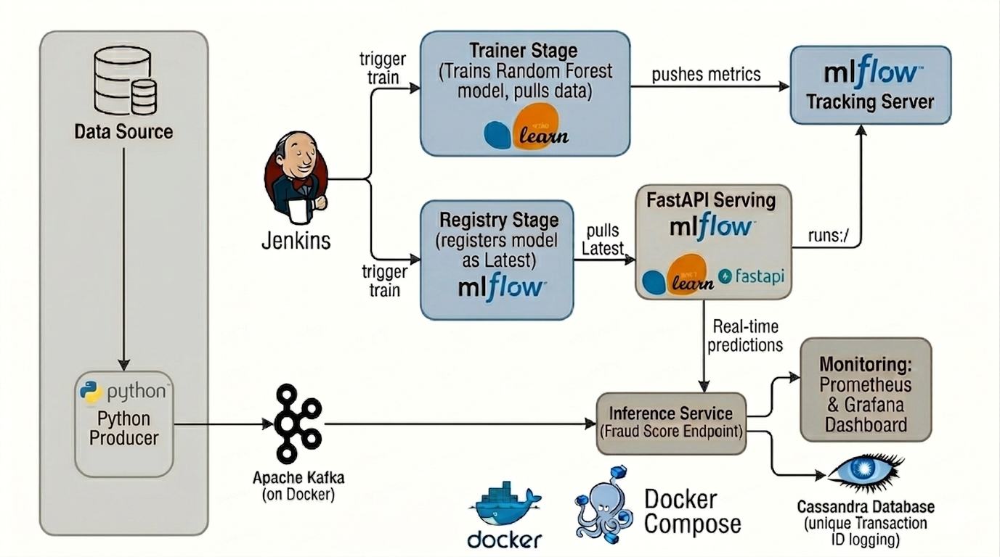
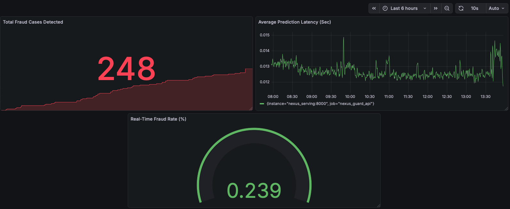

# NexusGuard: A Real-Time End-to-End MLOps Pipeline with Kafka, MLflow, Cassandra, and Jenkins

[](architecture_diagram.png)

## Overview
**NexusGuard** is a sophisticated, industrial-grade MLOps platform designed for real-time fraud detection in financial transactions. It bridges the gap between high-velocity streaming data engineering and machine learning lifecycle management. The system is built on a containerized microservices architecture, featuring a robust automated pipeline that handles everything from data ingestion and model training to real-time inference and observability.

A key highlight is the **Zero-Touch Deployment** model: using Jenkins and Docker, the system automatically retrains models on new data, registers them in the MLflow Model Registry, and hot-swaps the serving layer without manual intervention.

## Core Features
* **Event-Driven Ingestion:** Apache Kafka and Zookeeper handle high-throughput real-time transaction input.
* **Automated ML Lifecycle (CI/CD for ML):** Fully orchestrated training and deployment pipeline using Jenkins and Docker.
* **Experiment & Model Registry:** Comprehensive tracking of hyperparameters, metrics, and versioned model artifacts using MLflow.
* **High-Concurrency Serving:** FastAPI provides a low-latency REST interface for real-time fraud scoring.
* **Scalable NoSQL Storage:** Apache Cassandra ensures persistent, distributed storage for every transaction log and prediction result.
* **Full-Stack Observability:**
    * **Prometheus:** Scrapes operational metrics and custom business logic (e.g., fraud count).
    * **Grafana:** Visualizes real-time dashboards with model performance and fraud-rate analytics.
* **Ephemeral Training Layer:** A dedicated, short-lived Docker container trains the model and exits, optimizing resource usage.

## Architecture Flow
1.  **Ingestion:** A Python-based Producer streams synthetic credit card transactions into Kafka topics.
2.  **Continuous Integration (Jenkins):** Triggered by code commits or schedule, Jenkins initiates the MLOps pipeline:
    * **Trainer Stage:** An ephemeral container pulls the latest data, trains a Scikit-Learn Random Forest model, and pushes metrics to MLflow.
    * **Registry Stage:** The model is registered in the MLflow Model Registry as the "Latest" version.
    * **Deployment Stage:** Jenkins restarts the Serving container to pull and serve the new model version.
3.  **Real-Time Inference:** The FastAPI service consumes the "Latest" model from MLflow and provides predictions for incoming requests.
4.  **Logging & Persistence:** Every prediction is logged into Apache Cassandra with a unique Transaction ID for audit trails.
5.  **Monitoring:** Prometheus tracks `total_fraud_detected` and latency, while Grafana visualizes these metrics on a live dashboard.

## Technologies Used
* **Languages:** Python 3.10 (Scikit-Learn, Pandas, FastAPI)
* **Streaming:** Apache Kafka, Zookeeper
* **Storage:** Apache Cassandra, PostgreSQL (MLflow Backend)
* **MLOps:** MLflow (Tracking & Registry)
* **Monitoring:** Prometheus, Grafana
* **CI/CD & DevOps:** Jenkins, Docker, Docker Compose

## Getting Started

### Prerequisites
* Docker and Docker Compose.
* Minimum 8GB RAM (16GB recommended for smooth performance).
* GitHub account for CI/CD integration.

## 📊 Dataset Information

The model is trained using the **Credit Card Fraud Detection** dataset. Due to GitHub's file size limits and best practices for repository management, the raw dataset is **not included** in this repository.

* **Source:** [Kaggle - Credit Card Fraud Detection](https://www.kaggle.com/datasets/mlg-ulb/creditcardfraud)
* **Format:** `CSV` (284,807 transactions)
* **Target Column:** `Class` (0 for Genuine, 1 for Fraud)

> [!IMPORTANT]  
> Before starting, please download the `creditcard.csv` from the link above and place it in the `data/` directory of this project.

### Steps to Run
1.  **Start the Infrastructure:**
    ```bash
    docker compose up -d --build
    ```
    *This command initializes all 10+ containers including the MLflow server, Kafka brokers, and the Cassandra cluster.*
2.  **Setup Jenkins Pipeline:**
    * Access Jenkins at `http://localhost:8080`.
    * Create a new Pipeline project named `NexusGuard-E2E`.
    * Point it to your GitHub repository and the included `Jenkinsfile`.
    * Run the build to trigger the first automated training and deployment.

### Visualize Results

[](grafana-diagram..png)

* **MLflow:** Visit `http://localhost:5001` to see training runs and registered models.
* **Grafana:** Visit `http://localhost:3000` (admin/admin) to view the real-time Fraud Analytics dashboard.
* **API Docs:** Visit `http://localhost:8000/docs` to test the prediction endpoint manually.

## Contributing
Contributions are welcome to enhance model accuracy or add more monitoring exporters. Please submit a Pull Request.
